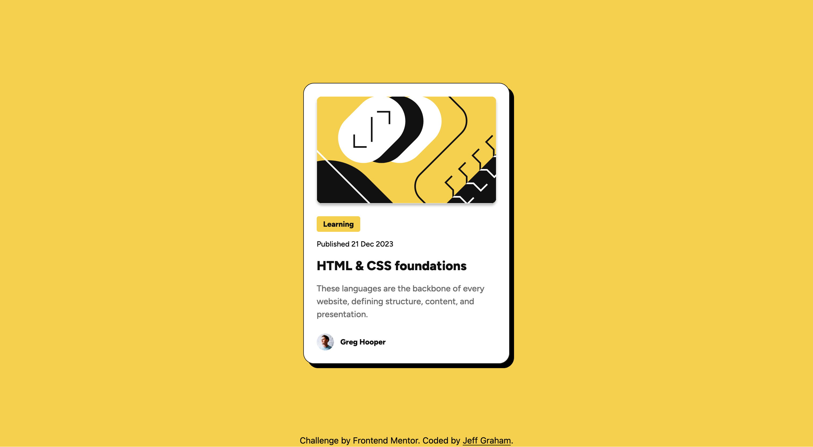

# Frontend Mentor - Blog preview card solution

This is a solution to the [Blog preview card challenge on Frontend Mentor](https://www.frontendmentor.io/challenges/blog-preview-card-ckPaj01IcS). Frontend Mentor challenges help you improve your coding skills by building realistic projects.

## Table of contents

- [Overview](#overview)
  - [The challenge](#the-challenge)
  - [Screenshot](#screenshot)
  - [Links](#links)
- [My process](#my-process)
  - [Built with](#built-with)
  - [What I learned](#what-i-learned)
  - [Continued development](#continued-development)
  - [Useful resources](#useful-resources)
- [Author](#author)

**Note: Delete this note and update the table of contents based on what sections you keep.**

## Overview

### The challenge

Users should be able to:

- See hover and focus states for all interactive elements on the page

### Screenshot

### Links

- Solution URL: [Github Repo](https://github.com/jeffgrahamcodes/blog-preview)
- Live Site URL: [https://blog-preview-seven-iota.vercel.app/](https://blog-preview-seven-iota.vercel.app/)

## My process

### Built with

- Semantic HTML5 markup
- Tailwind CSS (custom config)
- CSS custom properties (variables)
- Mobile-first workflow
- Git for version control

### What I learned

This project was an opportunity to practice applying atomic design principles using Tailwind CSS and custom properties. Here's a breakdown of my process:

1. **Initial structure** – I started by setting up the HTML scaffold with a semantic layout, using `<main>`, `<article>`, `<section>`, `<footer>`, and `<figure>` where appropriate.

2. **Visual styling** – I created custom CSS variables for colors, spacing, and border radius. This made it easy to reuse consistent design tokens across the card components.

3. **Category styling** – I styled the "Learning" tag with padding, background, and rounded corners using custom properties and Tailwind utilities.

4. **Author section** – I styled the author avatar and name using flexbox and spacing utilities to align them properly.

5. **Typography improvements** – I progressively refined text styles (font-size, color, and line-height), including responsive typography using Tailwind’s `sm:` prefix.

6. **Hover interaction** – I added hover effects to the card title to improve interactivity, including a color transition.

7. **Responsive design** – I made the card responsive by introducing a `--mobile-width` custom property and used Tailwind’s responsive classes (`sm:`) to adjust widths and font sizes based on screen size.

### Continued development

I’d like to go deeper into:

- Tailwind’s plugin ecosystem to extend utility classes cleanly
- Improving accessibility by integrating automated tools (e.g., Lighthouse or Axe)
- More sophisticated layout handling with container queries and CSS subgrid

### Useful resources

- [Tailwind CSS Docs](https://tailwindcss.com/docs) – for building custom utility classes and responsive design
- [MDN Web Docs](https://developer.mozilla.org/) – reference for semantic HTML and CSS properties

## Author

- Website - [jeffgraham.codes](https://jeffgraham.codes)
- Frontend Mentor - [@jeffgrahamcodes](https://www.frontendmentor.io/profile/jeffgrahamcodes)
- Bluesky - [@yourusername](https://www.twitter.com/yourusername)
